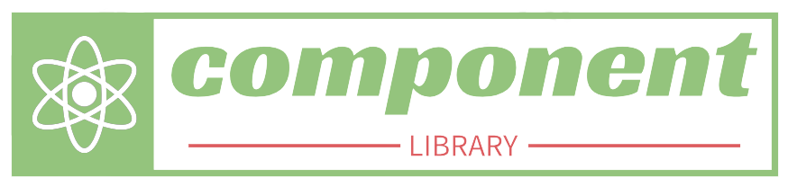

<p align='center'>
  
</p>

# Marvel UI Library

Marvel UI Library, is a specialized user interface (UI) library that has been developed by <b>RAPP Team</b> for internal use within products. By utilizing this custom react based library, Devsinc is able to enhance the functionality and aesthetic appeal of their products while maintaining a high level of consistency and efficiency in their development process.

<br/>

# Table of Contents

- [Installation](#installation)
- [Status](#status)
- [Website Hosting](#website-hosting)
- [Components](#components)
- [Code Examples](#code-examples)
- [Bugs and Feature Requests](#bugs-and-feature-requests)
- [Frameworks](#frameworks)

<br/>

# Installation

Please use the following command to use this package in your project
```bash
npm i marvel-ui
```
<br/>

# Status

[](https://github.com/ahmedwasim7/component-library)
[](https://www.npmjs.com/package/devsinc-lib)
 [](https://www.devsinc.com)

<br/>

# Website Hosting

You can access the live version of the Devsinc Ui Library at [Vercel](https://storybook-eosin.vercel.app/?path=/docs/devsinc-ui-library-introduction--docs).

<br/>

# Components

Following are the components that can be used from this library to enhance the functionality and aesthetic appeal while maintaining a high level of consistency in all products.

-  Button 
-  Typography 
-  CheckBox 
-  TextField 
-  ToggleSwitch 
-  Counter 
-  SearchInput 
-  TextArea 
-  DropDownComponent 
-  PopUp 
-  Color 


<br/>

# Code Examples

Following are the examples of devsinc-lib componenets usage

### Button Component
```jsx
import { Button } from 'devsinc-lib'

const App = () => (
  <Button
    label='Primary Button'
    type='primary'
    variant='success'
    postPosition
    onClick={() => console.log('Button clicked!')}
    style={{ width: '250px' }}
  />
)
```

<br/>

### ToggleSwitch Component
```jsx
import { ToggleSwitch } from 'devsinc-lib'

const App = () => (
  <>
    <h1>ToggleSwitch Example</h1>
    <ToggleSwitch
      onToggle={() => console.log('ToggleSwitch clicked!')}
      textLabel='Toggle Switch Label'
    />
  </>
)
```

<br/>

### TextField Component
```jsx
import { useState } from 'react'
import { TextField } from 'devsinc-lib'

const App = () => {
  const [name, setName] = useState('')

  const handleNameChange = updatedName => {
    setName(updatedName)
  }

  return (
    <>
      <h1>TextField Example</h1>
      <TextField 
        TextLabel='Enter your name:' 
        value={name} 
        onChange={handleNameChange} />
    </>
  )
}
```

<br/>

### TextArea Component
```jsx
import { useState } from 'react'
import { TextArea } from 'devsinc-lib'

const App = () => {
  const [feedback, setFeedback] = useState('')

  const handleFeedbackChange = e => {
    setFeedback(e.target.value)
  }
  
  return (
    <>
      <h1>TextArea Example </h1>
      <TextArea 
        textLabel='Feedback:'
        placeHolder='Enter your feedback here' 
        value={feedback} 
        onChange={handleFeedbackChange} />
    </>
  )
}
```

<br/>

### Typography Component
```jsx
import { Typography } from 'devsinc-lib'

const App = () => (
  <>
    <h1>Typography Example</h1>
    <Typography children='My text' size='h1' />
    <Typography children='My text' size='h2' />
    <Typography children='My text' size='h3' />
    <Typography children='My text' size='h4' />
    <Typography children='My text' size='h5' />
    <Typography children='My text' size='h6' />
  </>
)
```

<br/>

### CheckBox Component
```jsx
import { useState } from 'react'
import { CheckBox } from 'devsinc-lib'

const App = () => {
  const [isChecked, setIsChecked] = useState(false)
 
  const handleCheckBoxChange = checked => {
    setIsChecked(checked)
  }

  return (
    <>
      <h1>CheckBox Example</h1>
      <CheckBox 
       onClick={handleCheckBoxChange} 
       textLabel='Female' />
      <p>{isChecked ? 'The checkbox is clicked' : 'The checkbox is not clicked'}</p>
    </>
  )
}
```

<br/>

### Counter Component
```jsx
import { useState } from 'react'
import { Counter } from 'devsinc-lib'

const App = () => {
  const [value,setValue]=useState(0)

  return (
    <>
      <h1>Counter Example</h1>
      <Counter
        textLable='Quantity'
        placeHolder='Enter quantity'
        value={value}
        onChange={value => setValue(value)}
        disabled={false}
        labelClasses='myLabelClasses'
        className='myInputClasses'
        style={{ backgroundColor: '#F5F5F5' }}
        labelStyle={{ fontWeight: 'bold' }}
      />
    </>
  )
}
```

<br/>

### SearchInput Component
```jsx
import { useState } from 'react'
import { SearchInput } from 'devsinc-lib'

const App = () => {
  const [product, setProduct] = useState('')

  return (
    <>
      <h1>SearchInput Example</h1>
      <SearchInput
       placeholder='Search Product'
       value={value}
       onChange={productName => setValue(productName)}
      />
    </>
  )
}
```

<br/>

### PopUp Component

```jsx
import { PopUp } from 'devsinc-lib'

const App = () => {
  return (
    <>
      <h1>PopUp Example</h1>
      <PopUp
        title='Warning!'
        message='Do you want to delete this file?'
        leftButtonLabel='No'
        rightButtonLable='Yes'
        onClickRight={() => console.log('Right button clicked')}
        onClickLeft={() => console.log('Left button clicked')}
      />
    </>
  )
}
```

<br/>

# Bugs and Feature Requests

Have a bug or a feature request? [Contact Us](rappdevsinc@gmail.com)

<br/>

# Frameworks

Devsinc Ui Library supports these frameworks.

- React.js 
- Next.js
- Ruby
- Vue.js
